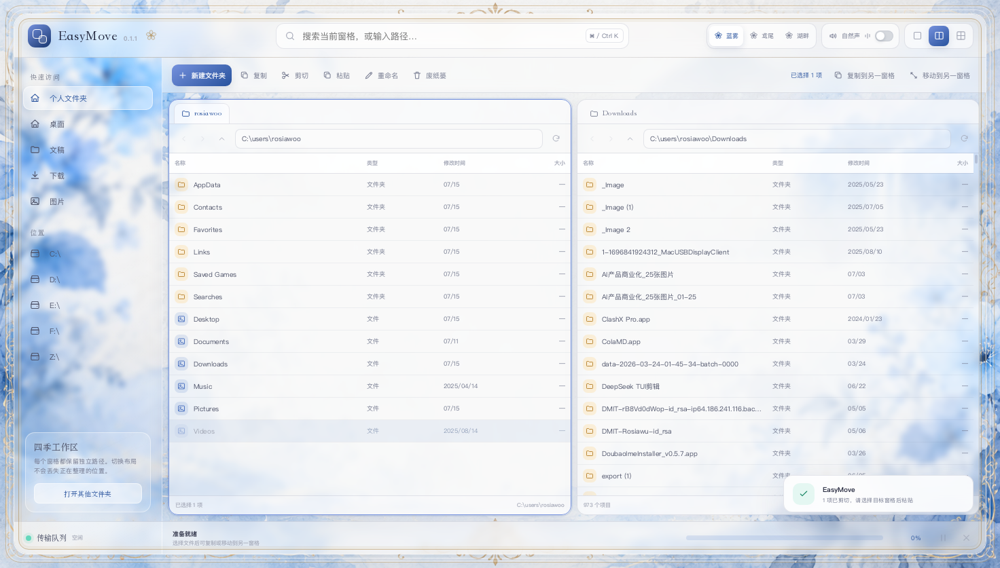

# EasyMove 0.3.0

EasyMove 是一款面向 Windows 与 macOS 的多窗格文件管理器。它把复制、移动、剪切和粘贴放在界面中心，同时保留克制、通透的水彩气质。



## 功能

- 单窗格、双窗格、四窗格自由切换，每个窗格拥有独立路径和浏览历史
- 多选文件，复制、剪切、粘贴、移动到另一窗格、重命名、新建文件夹
- 后台递归计算文件夹内部所有文件的总大小，目录切换和刷新不会被旧结果污染
- 每个窗格独立按名称、类型、修改时间或大小排序，文件夹始终优先，设置在路径切换与刷新后保留
- 每个窗格独立提供图标、列表、Finder 式分栏和画廊四种视图，视图与路径在重启后保留
- 图片显示真实缩略图；文件夹以自然名称顺序的第一份可预览内容作为封面
- macOS 通过 Quick Look 预览 PDF 首页和视频帧；TXT/Markdown 与 DOCX/PPTX/XLSX 生成包含真实文字或单元格内容的预览卡
- 预览失败时明确显示“无法生成内容预览”和原因，不使用类型图标冒充内容
- 悬停文件或文件夹图标 400ms 显示大图、元数据和文件夹前五项，快速切换不会串项
- 像 Windows 文件管理器一样拖放：同盘默认移动、跨盘默认复制，可直接拖到另一窗格或具体文件夹
- 支持从 Finder/Explorer 将文件或文件夹直接拖入 EasyMove
- 支持把 EasyMove 中的真实文件拖出到 Finder/Explorer
- 删除时进入 macOS 废纸篓或 Windows 回收站
- 大文件传输进度、暂停、继续和取消
- 重名文件自动保留双方，并为新文件生成不冲突的名称
- 三套内置主题：蓝雾花笺、鸢尾梦境、湖畔手帐
- 可导入 PNG、JPEG 或 WebP 图片作为自定义主题，应用重启后仍会保留
- 高透明毛玻璃界面，水彩花卉与湖景底图清晰可见
- 四边保留无遮挡的水彩画框，内容面板不会覆盖边缘花卉
- 可关闭的程序化流水与鸟鸣环境声；不收集或上传用户文件

## 下载与安装

### macOS

当前 0.3 安装包支持 Apple Silicon（M1/M2/M3/M4/M5）Mac。打开 DMG，将 EasyMove 拖到“应用程序”。

此测试版尚未使用 Apple Developer ID 签名或公证。若 macOS 阻止首次启动，请在 Finder 中右键 EasyMove，选择“打开”；也可前往“系统设置 → 隐私与安全性”选择“仍要打开”。

### Windows

当前安装包支持 Windows 10/11 x64。运行 EXE 后可选择安装位置。

此测试版尚未购买代码签名证书。如果 Microsoft Defender SmartScreen 提示未知发布者，请先核对本仓库 Release 中的 SHA-256，再选择“更多信息 → 仍要运行”。

## 快捷键

| 功能 | macOS | Windows |
| --- | --- | --- |
| 复制 | `⌘ C` | `Ctrl C` |
| 剪切 | `⌘ X` | `Ctrl X` |
| 粘贴 | `⌘ V` | `Ctrl V` |
| 将已复制项目移动到这里 | `⌥ ⌘ V` | — |
| 全选 | `⌘ A` | `Ctrl A` |
| 新建文件夹 | `⇧ ⌘ N` | `Ctrl Shift N` |
| 定位路径/搜索框 | `⌘ K` | `Ctrl K` |
| 重命名 | `Return` | `F2` |
| 移到废纸篓/回收站 | `⌘ Delete` | `Delete` |

## 拖放操作

- 直接拖动：同一磁盘移动，跨磁盘复制
- 拖到文件夹行：把项目传输到该文件夹
- 拖到窗格空白区域：把项目传输到该窗格当前目录
- `Ctrl`（Windows）或 `Option`（macOS）+ 拖动：强制复制
- `Shift` + 拖动：强制移动

拖放使用与工具栏相同的传输引擎，因此同样支持进度显示、暂停、继续、取消和重名保护。


## 自定义主题

点击顶部主题栏的“我的”：

1. 选择一张 PNG、JPEG 或 WebP 图片，最大 50 MB。
2. EasyMove 会在本机用户数据目录保存一份副本并立即应用。
3. 点击任一内置主题可随时切回；再次点击“我的”可恢复已保存的图片。
4. 当“我的”已经启用时再次点击，可以选择新图片替换。

图片不会上传网络；导入后移动或删除原图也不会影响主题。自定义主题在应用重启后继续保留。


## 本地开发

需要 Node.js 22 或更高版本。

```bash
npm ci
npm start
```

静态检查与构建：

```bash
npm run check
npm run dist:mac
npm run dist:win
```

建议分别在 macOS 和 Windows 上生成对应平台安装包。仓库内的 GitHub Actions 工作流会在两个原生运行环境中自动完成构建。

## 技术与安全

EasyMove 使用 Electron 构建，界面运行于隔离的渲染进程中：`contextIsolation` 已开启、`nodeIntegration` 已关闭、沙箱已开启。文件系统能力只通过预加载层中明确列出的 API 暴露给界面。

所有文件操作都在本机完成。自然声由 Web Audio 实时合成，不需要网络请求或音频素材。

## 0.3.0 支持矩阵与已知限制

| 格式 | macOS 预览 | Windows 预览 | 内容验证方式 |
| --- | --- | --- | --- |
| JPEG/PNG/GIF/WebP | 支持 | 支持 | 安全解码、真实像素缩略图 |
| MP4/MOV | Quick Look 视频帧 | 不支持 | Quick Look 输出帧 |
| PDF | Quick Look 首页 | 不支持 | Quick Look 页面图像 |
| TXT/Markdown | 支持 | 支持 | 真实文本预览卡 |
| DOCX/PPTX/XLSX | 文字内容 fallback；Quick Look 可用时优先 | 文字内容 fallback | OOXML XML 内容提取 |
| Pages/Keynote/Numbers、旧 DOC/PPT/XLS | 依赖系统 Quick Look | 不支持 | 失败时明确不可预览 |

Quick Look 的覆盖范围仍取决于 macOS 版本与已安装预览生成器；权限不足、损坏、消失、超大或超时文件会显示明确失败状态。当前没有把文件类型图标算作内容预览。

## 0.3 已知限制

- macOS 预构建包目前仅提供 Apple Silicon 版本
- 发布包尚未使用商业代码签名或 Apple 公证
- Windows 版本已通过 Wine 验证启动、真实目录读取和文件复制；发布前仍建议在真实 Windows 10/11 机器上完成一轮安装验收
- 暂不提供网络驱动器、云盘账号接入、文件内容搜索和传输队列持久化
- Quick Look 支持范围取决于本机 macOS 与已安装应用；Windows 非图片文件目前回退类型图标
- 重名冲突目前采用“自动保留双方”，尚未提供逐项覆盖对话框

## 参与贡献

欢迎提交 Issue 与 Pull Request。开始前请阅读 [CONTRIBUTING.md](CONTRIBUTING.md) 和 [CODE_OF_CONDUCT.md](CODE_OF_CONDUCT.md)。

## 许可

源代码以 [MIT License](LICENSE) 开源。三张主题底图由项目所有者提供并确认可随 EasyMove 重新分发，详情见 [assets/ASSET-LICENSE.md](assets/ASSET-LICENSE.md)。
